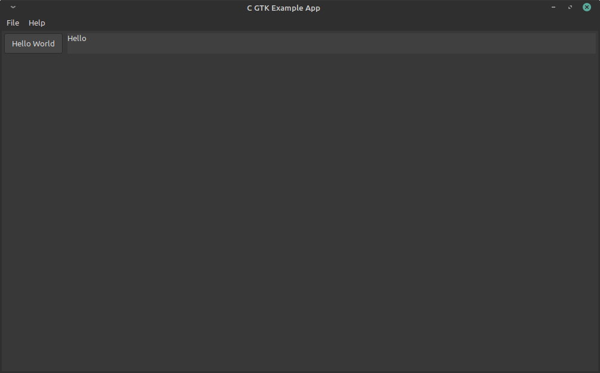

# GTK Test Application

Test application using Gtk C code.

This repository can also be used as a good GTK template!

For C++ example using Gtkmm, [see this other repository](https://github.com/danger89/cpp-gtk-test-app).

